# Rec Soccer Coaching Plans

*Weekly practice plans with interactive checklists and auto-saved notes.*

⚽ Season plans for rec soccer coaching. Each plan includes structured drills, game scenarios, and weekly practice sessions.

### 🥅 Lesson Plans

<!-- GENERATE_ACTIVE_TABLE -->
| Week | Day | Plan |
|------|-----|------|
| WEEK 1 | Wednesday | [Footwork & Formation Foundations](https://html-preview.github.io/?url=https://github.com/paulpas/rec-soccer-plans/blob/main/week1_lesson_plan_enhanced.html) |
| WEEK 1 | Wednesday | [Extreme Heat Adaptation — Day 2](https://html-preview.github.io/?url=https://github.com/paulpas/rec-soccer-plans/blob/main/week1_wed_lesson_plan_enhanced.html) |
| WEEK 2 | Monday | [Passing Into Space](https://html-preview.github.io/?url=https://github.com/paulpas/rec-soccer-plans/blob/main/week2_lesson_plan_enhanced.html) |
| WEEK 2 | Wednesday | [Passing Into Space: Adding Movement](https://html-preview.github.io/?url=https://github.com/paulpas/rec-soccer-plans/blob/main/week2_wed_lesson_plan_enhanced.html) |
<!-- END_GENERATE_ACTIVE_TABLE -->

### 📋 Proposed / Draft Plans

> Files with "proposed" or "draft" in the filename appear here automatically. These are not yet finalized for the season schedule.

<!-- GENERATE_PROPOSED_TABLE -->
| Week | Day | Plan |
|------|-----|------|
| WEEK 2 | Proposed | [Footwork → Game Application: V-Push Gates & Treasure Keepers](https://html-preview.github.io/?url=https://github.com/paulpas/rec-soccer-plans/blob/main/week2_proposed_lesson_plan_enhanced.html) |
<!-- END_GENERATE_PROPOSED_TABLE -->
